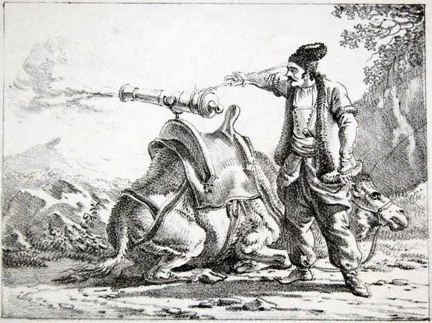
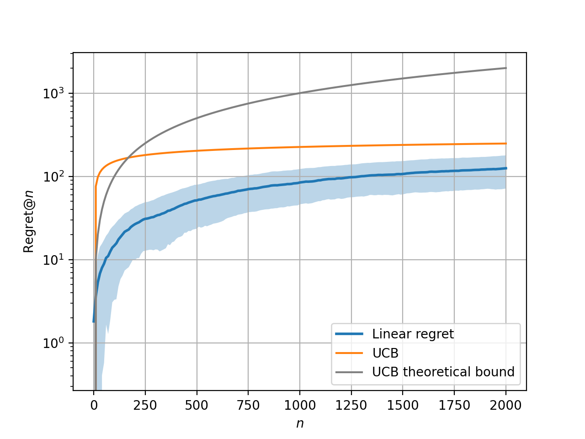
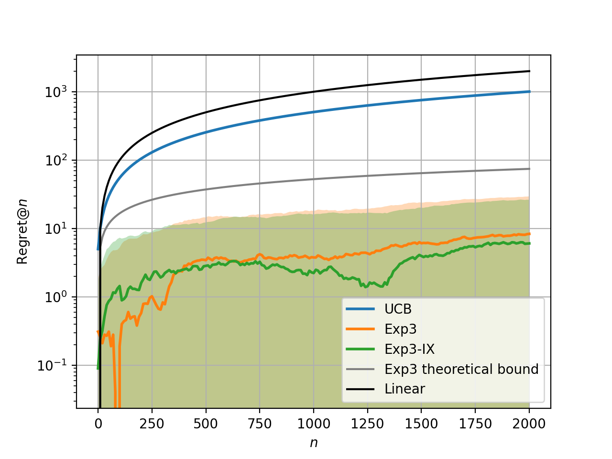

# zamburak

This repository contains implementation of bandit algorithms in
OCaml and their application to trading.

<p align="middle">
  
</p>

> Zamburak (Persian: زمبورک), literally meaning wasp, was a specialized
> form of self-propelled artillery from the early modern period,
> featuring small cannons fired from swivel-mounts on camels.
[[1]](https://en.wikipedia.org/wiki/Zamburak)

# Installation

To get the same plots as are shown in this readme you might need to do
```
opam pin --dev-repo matplotlib
git clone https://github.com/MichaelKonobeev/zamburak.git
```
otherwise just pin to this repository to use `zamburak` package
```
opam pin https://github.com/MichaelKonobeev/zamburak.git
```

# Stochastic & Adversarial *k*-armed bandits

The following figures show results of running UCB algorithm on
stochastic bandit (left) and UCB, Exp3, Exp3-IX algorithms on
adversarial bandit (right).  The results could be reproduced by
running `make ucb.exe` and `make exp3.exe` respectively. Note that
since adversarial bandit is specifically designed against UCB
algorithm, this algorithm has linear regret on it.

<p align="middle">
  
  
</p>

# Stock trading

*k*-armed bandit algorithms and their modifications were applied
(`make trade.exe`) to stock trading problem to buy for the duration
of a single day $1 worth of stock of one of several companies.
The companies are either from the set of fortune 500 companies,
or from some randomly selected set of companies. The results
are averaged over 1000 runs and are the following.

For fortune 500:

|        | Random      | UCB | Stock-UCB | Exp3 | Stock-Exp3 |
| ------ | ----------- | --- | --------- | ---- | ---------- |
| Regret | 2.9190±0.68 | 3.7203 | 0.3138 | 2.8982±0.70 | **0.1786±0.07** |
| Payoff | 1.1057±0.68 | 0.3044 | 3.7109 | 1.1265±0.70 | **3.8460±0.07** |

For random companies:

|        | Random       |   UCB   | Stock-UCB | Exp3 | Stock-Exp3 |
| ------ | ------------ | ------- | --------- | ---- | ---------- |
| Regret |  2.1743±1.02 |  4.3192 | **0.4174** | 2.1776±1.09 | 0.9386±0.34 |
| Payoff | -0.2621±1.02 | -2.4070 | **1.4948** | -0.2654±1.09 | 0.9736±0.34 |


# References
1. [https://en.wikipedia.org/wiki/Zamburak](https://en.wikipedia.org/wiki/Zamburak)
2. Lattimore, Tor, and Csaba Szepesvári. Bandit algorithms. Cambridge University Press, 2020.
3. [https://jeremykun.com/2013/12/09/bandits-and-stocks/](https://jeremykun.com/2013/12/09/bandits-and-stocks/)
